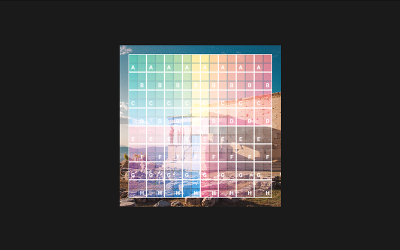

# Boxy - 2D GPU rendering with a tiling atlas.

`nimble install boxy`


[API reference](https://treeform.github.io/boxy)

## About

Boxy is an easy to use 2D GPU rendering API built on top of [Pixie](https://github.com/treeform/pixie).

The basic model for using Boxy goes something like this:

* Open a window and prepare an OpenGL context.
* Load image files like .png using Pixie.
* Render any dynamic assets (such as text) into images once using Pixie.
* Add these images to Boxy, where they are put into a tiling atlas texture.
* Draw these images to screen each frame.

## Videos

* [Efficient 2D rendering on GPU](https://www.youtube.com/watch?v=UFbffBIzEDc)
* [GPU Gaussian Blur in Nim using Boxy and Shady](https://youtu.be/oUB0BGsNY5g)

## Basic Example

```nim
import boxy, opengl, windy

let windowSize = ivec2(1280, 800)

let window = newWindow("Windy + Boxy", windowSize)
makeContextCurrent(window)

loadExtensions()

let bxy = newBoxy()

# Load the images.
bxy.addImage("bg", readImage("examples/data/bg.png"))
bxy.addImage("ring1", readImage("examples/data/ring1.png"))
bxy.addImage("ring2", readImage("examples/data/ring2.png"))
bxy.addImage("ring3", readImage("examples/data/ring3.png"))

var frame: int

# Called when it is time to draw a new frame.
proc display() =
  # Clear the screen and begin a new frame.
  bxy.beginFrame(windowSize)

  # Draw the bg.
  bxy.drawImage("bg", rect = rect(vec2(0, 0), windowSize.vec2))

  # Draw the rings.
  let center = windowSize.vec2 / 2
  bxy.drawImage("ring1", center, angle = frame.float / 100)
  bxy.drawImage("ring2", center, angle = -frame.float / 190)
  bxy.drawImage("ring3", center, angle = frame.float / 170)

  # End this frame, flushing the draw commands.
  bxy.endFrame()
  # Swap buffers displaying the new Boxy frame.
  window.swapBuffers()
  inc frame

while not window.closeRequested:
  display()
  pollEvents()
```

## Emscripten

Boxy can be compiled to WebAssembly using Emscripten. See the [Emscripten tutorial](https://github.com/treeform/nim_emscripten_tutorial) for more information on how Emscripten works with Nim and things you need to know.

To compile any of the examples:
```sh
nim c -d:emscripten examples/basic_windy.nim
```

This will generate:
* HTML shell: `examples/basic_windy.html`
* Preloaded data: `examples/basic_windy.data`
* JavaScript: `examples/basic_windy.js`
* WebAssembly: `examples/basic_windy.wasm`

Then run the compiled HTML file:
```sh
emrun examples/basic_windy.html
```

## Examples

You can use boxy with industry standard windowing libraries like [GLFW](https://github.com/treeform/boxy/blob/master/examples/basic_glfw.nim) and [SDL2](https://github.com/treeform/boxy/blob/master/examples/basic_sdl2.nim).


But the preferred way is to use Boxy with my own Nim native windowing library [Windy](https://github.com/treeform/boxy/blob/master/examples/basic_windy.nim).


[Hexmap](https://github.com/treeform/boxy/blob/master/examples/hexmap.nim)


[Bigbang](https://github.com/treeform/boxy/blob/master/examples/bigbang.nim)



[Blending](https://github.com/treeform/boxy/blob/master/examples/blending.nim)


[Blur](https://github.com/treeform/boxy/blob/master/examples/blur.nim)


[Masking](https://github.com/treeform/boxy/blob/master/examples/masking.nim)


[Shadow](https://github.com/treeform/boxy/blob/master/examples/shadow.nim)


[Check out more examples here.](https://github.com/treeform/boxy/tree/master/examples)
